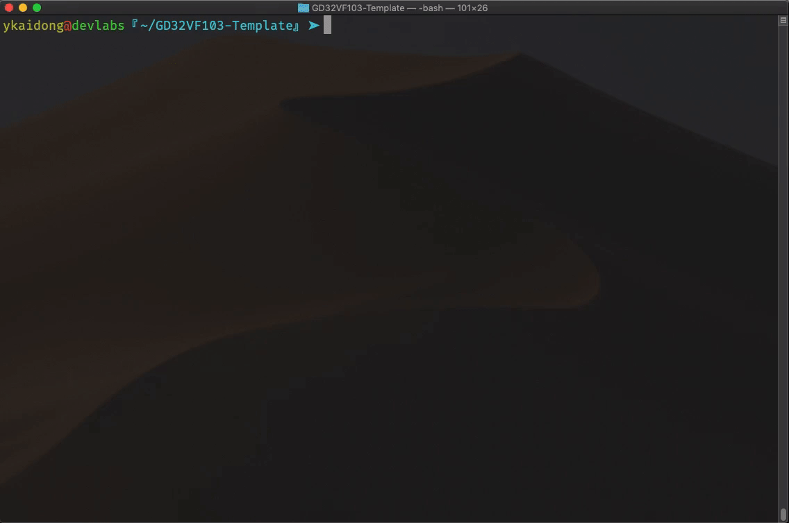
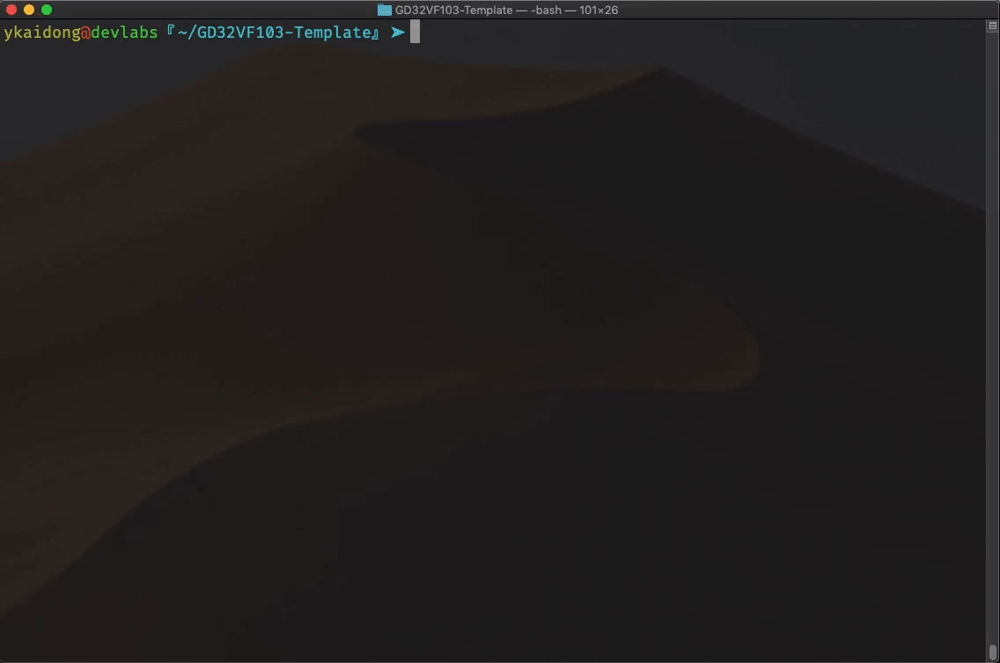
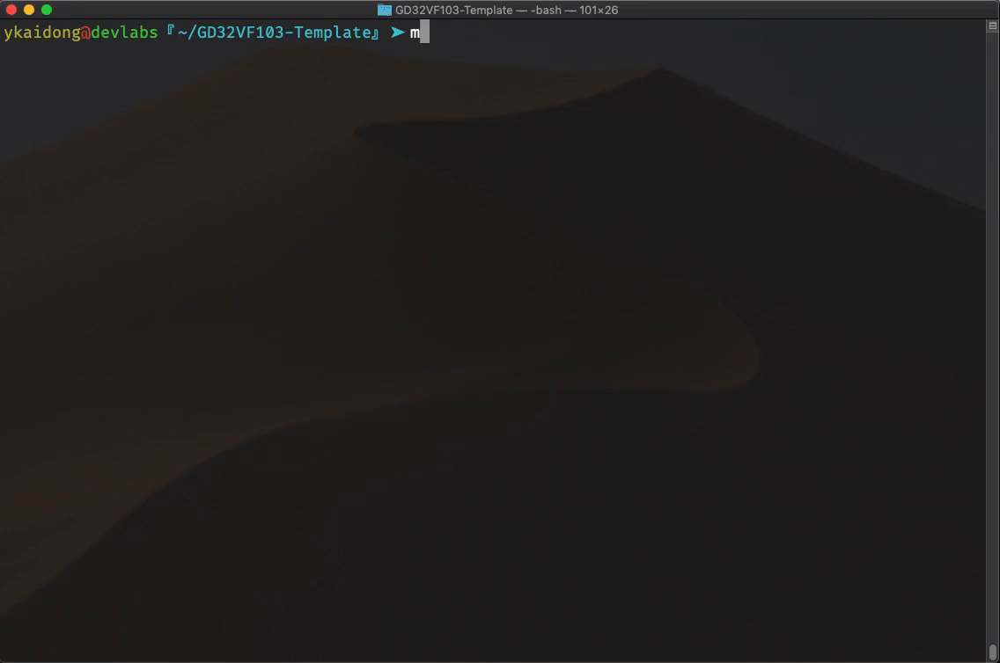
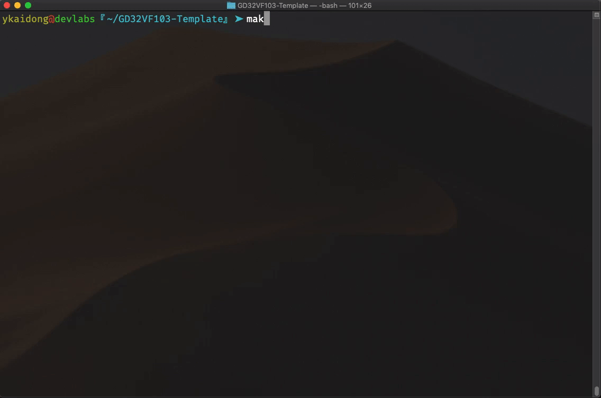

# GD32VF103-Template
---
这是使用Makefile编译GD32VF103 RISCV系列MCU工程的模板, 已经包含了官方V1.1.0库, 只保留了Firmware目录.

MCU型号为GD32VF103CBT6, 在GPIOA的PIN1上接了一颗LED, 同时引出了USART0, 此模板的代码会在启动时在串口输出"Hello, RISC-V!", 同时使LED以1Hz的频率闪烁.

此模板工作环境为macOS Mojave 10.14.6, 使用riscv-gnu-toolchain, 编译器为`riscv32-unknown-elf-gcc`, 未在其它环境测试, 使用如下命令编译:

```shell
make
```



编译完成后将会在./build目录生成对应的.elf, .hex, .bin文件.

## 使用OpenOCD
可以使用`DAP-Link`连接MCU进行调试, 其它类型的JTAG调试器未经过测试, 请自行处理.

注意在macOS上使用`brew install OpenOCD` 安装的`OpenOCD`是不能正常进行调试的, 需要编译[芯来官方fork的`OpenOCD`](https://github.com/riscv-mcu/riscv-openocd)才可以. 

模板目录中的gd32vf103.cfg为芯来官方提供的OpenOCD调试配置文件, 可直接使用. 
另外需要调试时需要在Makefile中`debug`选项设置为1, 以生成附带调试信息的目标文件. 

### 使用OpenOCD下载:
使用OpenOCD下载请使用如下命令:
```shell
make flash
```



### 使用OpenOCD调试:
使用OpenOCD调试请使用如下命令:
```shell
make debug
```



执行完上述命令后OpenOCD将会等待GDB连接, 请在当前目录打开新的命令行窗口, 执行如下命令进入GDB:
```shell
riscv32-unknown-elf-gdb ./build/GD32VF103.elf
```
再依次输入如下命令即可调试:

```shell
target remote localhost:3333
monitor reset
monitor halt
load
```


## 使用dfu-util

如果你安装了`dfu-util`, 可使用如下命令下进行dfu下载:
```shell
make dfu
```



注: 在执行命令前请正确设置boot引脚电平(boot0=1, boot1=0).

另外, 使用dfu下载比使用openOCD下载速度要快很多倍. 


